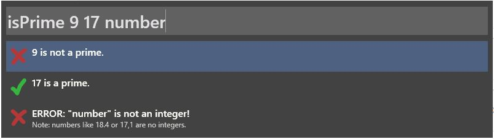

# Wox: Is Prime?

Python plugin for wox which checks if the given attributes are prime numbers.

## Publishing a Wox-Plugin

Some stuff I stumbled upon while publishing this plugin:

- The UUID in plugin.json does not accept the '-' delimiter, remove it.
- dot-JPG is not an acceptable file-extension, dot-jpg is.
- Your plugin is suppossed to be a '.wox' file. But it has to be a .zip file as well. You've to zip your files and change the file-extension for god only knows which reasons.

